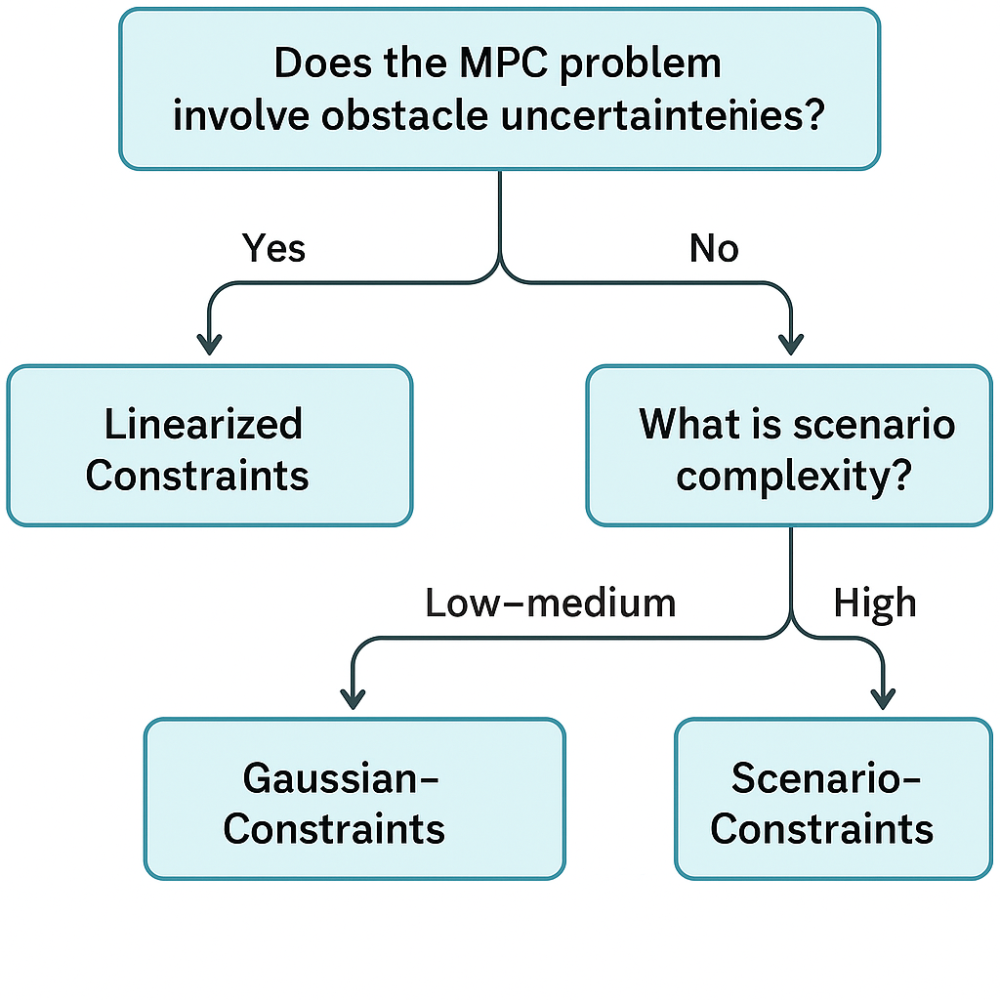

A modular and extensible Python port of the [TUD-AMR MPC Planner](https://github.com/tud-amr/mpc_planner), designed for real-time motion planning under constraints. PyMPC brings together math utilities, solver-agnostic optimization backends (e.g. CasADi, OSQP), and a flexible constraint interface to support rapid prototyping and deployment of Model Predictive Control systems.

---

## 🚀 Features

- **Model Predictive Control (MPC)** framework in Python
- Modular design for swapping solvers or models
- Support for:
  - State/input constraints
  - Soft and hard constraints
  - Obstacle avoidance
- Built-in math utilities for dynamics, linearization, etc.
- Modification of the original [C++ codebase](https://github.com/tud-amr/mpc_planner)
- Unit-test friendly structure for rapid development

---

## Constraints 

| Constraint Type            | Main Idea                                                       | Obstacle Handling                                   | Uncertainty Handling | Computational Cost | Compatible Solvers |
|---------------------------|-----------------------------------------------------------------|------------------------------------------------------|----------------------|--------------------|---------------------|
| **LinearizedConstraints** | Linearize nonlinear constraints near current trajectory       | Deterministic positions                              | ❌ No               | **Low**           | QP, SQP            |
| **EllipsoidConstraints**  | Approximate obstacles as ellipsoids for smooth convex regions | Static or dynamic obstacles                          | ❌ No               | **Medium**        | SQP, NLP           |
| **GaussianConstraints**   | Probabilistic modeling using Gaussian mean & covariance       | Dynamic obstacles with Gaussian uncertainty          | ✅ Yes              | **Medium-High**   | NLP                |
| **DecompositionConstraints**| Divide road into convex safe regions                        | Road boundaries, static obstacles                    | ❌ No               | **Medium**        | QP, SQP            |
| **GuidanceConstraints**   | Multi-homotopy guided optimization (parallel planners)        | All obstacle types via global guidance               | ✅ Partial (via global plan diversity) | **High**          | NLP (or multiple QPs in parallel) |
| **ScenarioConstraints**    | Robust MPC via sampled uncertainty scenarios                 | Requires probabilistic predictions (non-deterministic)| ✅ Yes             | **Very High**     | NLP                |


| Method                   | How It Handles Uncertainty                          | Key Parameters                       | Pros                                         | Cons                                           |
|-------------------------|-----------------------------------------------------|--------------------------------------|---------------------------------------------|-----------------------------------------------|
| **GaussianConstraints**| Chance constraints using Gaussian distributions     | Risk level (α), covariance of obstacle| Smooth, risk-adjustable, mathematically elegant | Requires accurate uncertainty model; heavier solve |
| **ScenarioConstraints**| Monte Carlo sampling of obstacle trajectories       | Number of scenarios, safe horizon    | Robust to arbitrary distributions           | Very expensive, needs many solvers in parallel   |
| **GuidanceConstraints**| Uses multiple global guidance paths to hedge risk   | Number of homotopy classes (paths)   | Finds safe topologies, avoids local minima | Indirect uncertainty handling, depends on guidance planner |



---

## 🛠 Installation

```bash
git clone https://github.com/stephen-crawford/PyMPC.git
cd PyMPC
pip install -e .
Requires Python 3.8+, NumPy, and optionally CasADi or OSQP depending on your backend.
```

To run tests you may need to add the following run configuration: ```LD_LIBRARY_PATH=/opt/ros/humble/lib:/opt/ros/humble/lib/x86_64-linux-gnu:$LD_LIBRARY_PATH```


Related Work
This library is a Python port of the excellent tud-amr/mpc_planner, originally written in C++. Our goal is to preserve its structure and intent while providing a more flexible, Pythonic interface for rapid development and experimentation.

Contributing
Contributions welcome! If you'd like to add models, constraints, or solver support, open a pull request or issue.

MIT License
